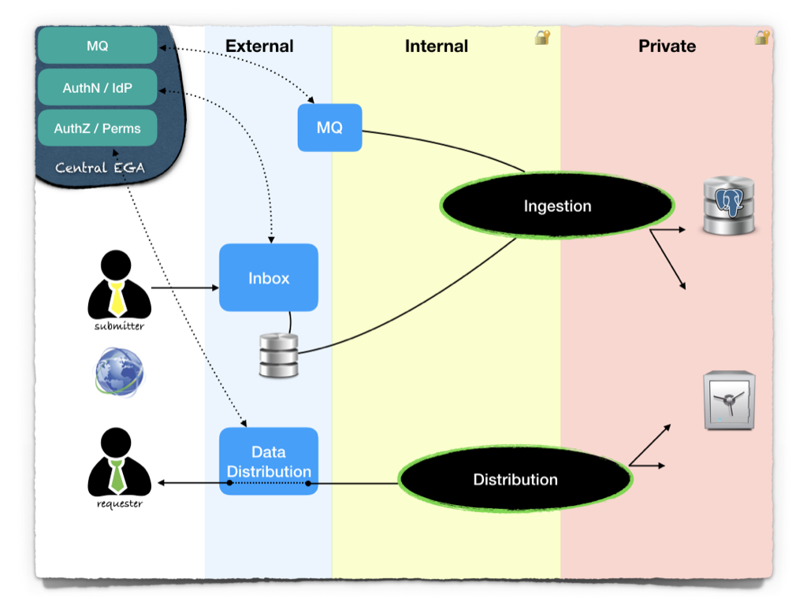

# Local EGA main repository

The [code](ingestion/lega) is written in Python (3.7+).

You can provision and deploy the different components, locally, using [docker-compose](deploy).

## Quick install

	cd deploy
	make -C bootstrap
	make -j 4 images
	make up

After a few seconds, you then have a locally-deployed instance of
LocalEGA (using a fake Central EGA), and you can run the
[testsuite](tests).

## Architecture

Find the [LocalEGA documentation](http://localega.readthedocs.io) hosted on [ReadTheDocs.org](https://readthedocs.org/).

Other provisioning methods are provided by [our partners](https://github.com/neicnordic/LocalEGA):

* on an [OpenStack cluster](https://github.com/NBISweden/LocalEGA-deploy-terraform), using `terraform`;
* on a [Kubernetes/OpenShift cluster](https://github.com/NBISweden/LocalEGA-deploy-k8s), using `kubernetes`;
* on a [Docker Swarm cluster](https://github.com/NBISweden/LocalEGA-deploy-swarm), using `gradle`.
