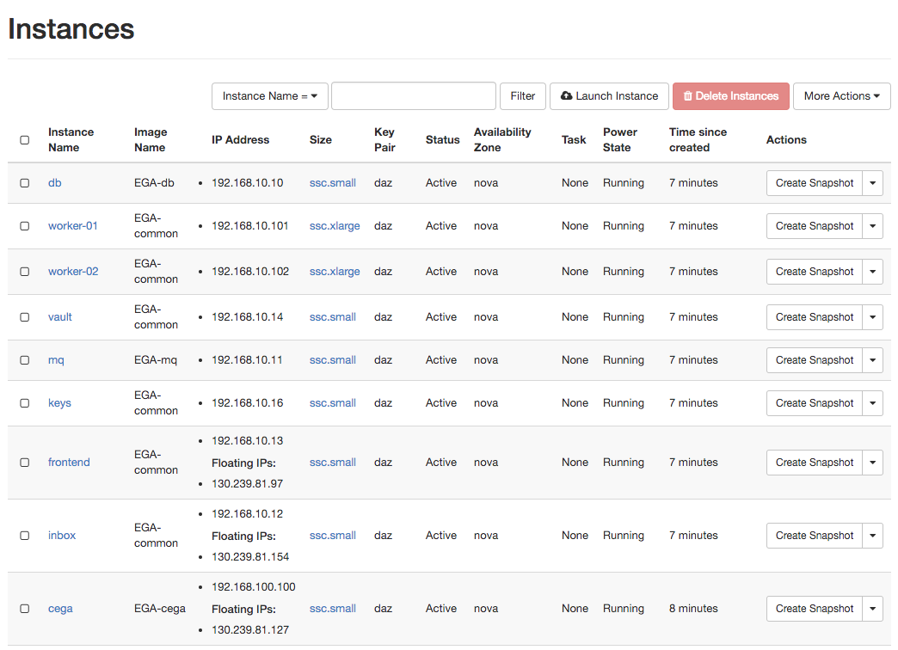
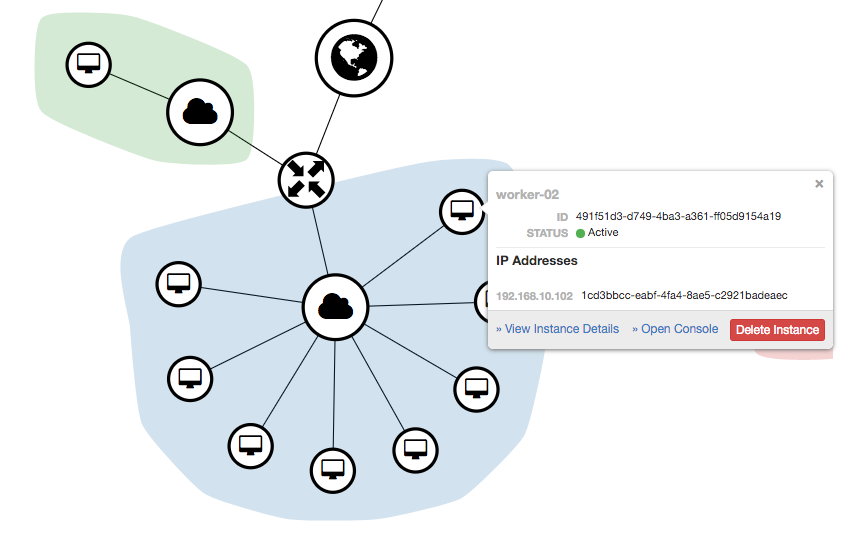

# Deploy LocalEGA on Openstack using Terraform

## Preliminaries

You need to prepare a file with your cloud credentials and source it.

Have a look at `credentials.rc.sample` and _"fill in the blanks."_

The file contains the Openstack configuration along with a few
variable for Terraform.

## Create a fake Central EGA

	cd cega
	./bootstrap.sh swe1 fin1   # List of space separated instances
	terraform init
	terraform apply
	
## Create an instance of Local EGA

Move back to the main directory for Terraform (ie `cd ..`).
The following creates _one_ instance of Local EGA.

	bootstrap/run.sh
	terraform init
	terraform apply
	
That's it. Wait for Terraform to contact your cloud and create the resources.

Services are started, and Volumes are mounted, using Systemd units.

## Demo

## Stopping

	cd cega
	terraform destroy
	cd ..
	terraform destroy

Type `yes` for confirmation (or use the `--force` flag)

## Build the EGA-common, EGA-db and EGA-mq images

	cd images/centos7
	terraform init
	terraform apply

The booted VMs use a CentOS7 Cloud image and are configured with
`cloud-init`. Once configured, they are powered off.

You can then take a snapshot of them and call them 'EGA-common',
'EGA-db', 'EGA-mq' and 'EGA-cega'.
